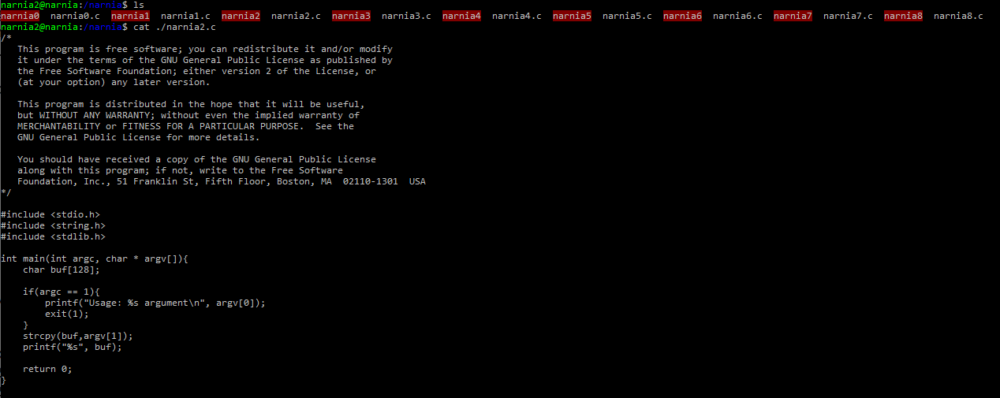
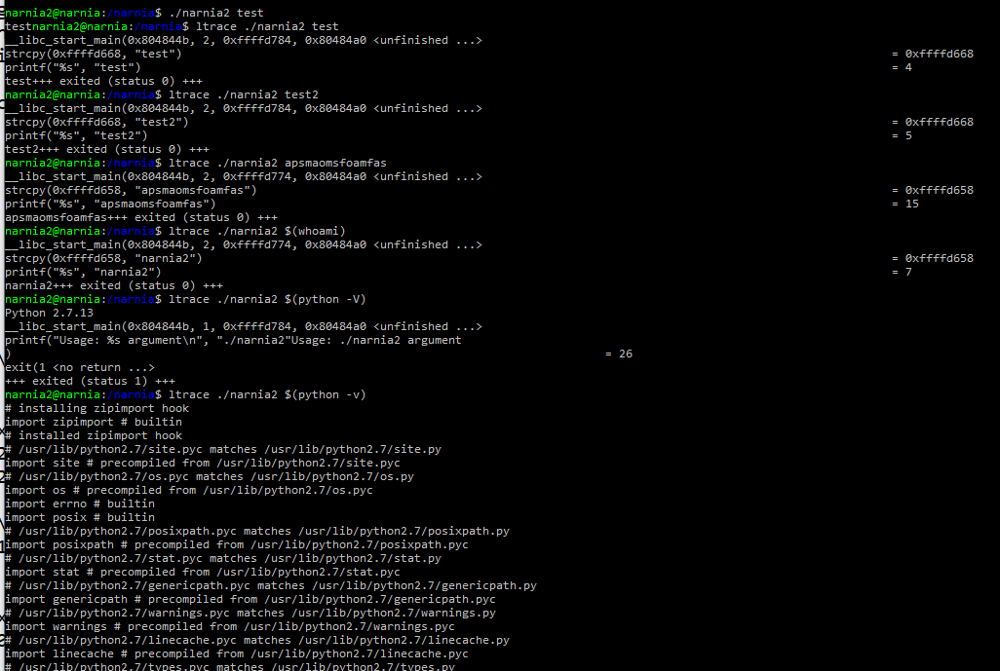
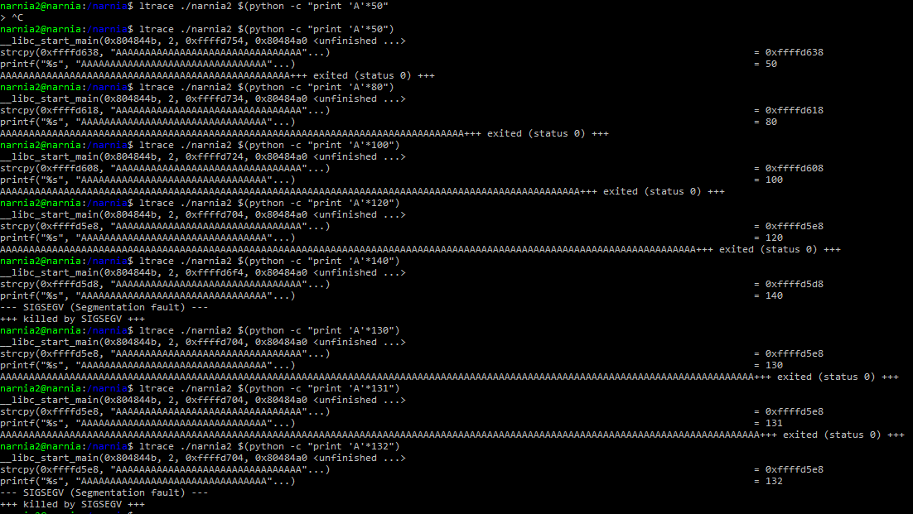
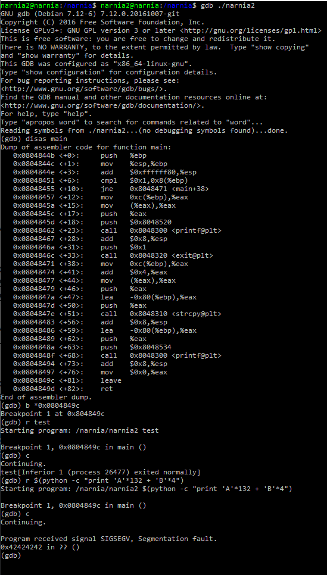
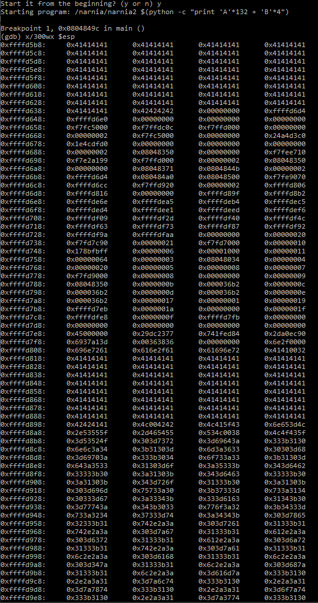
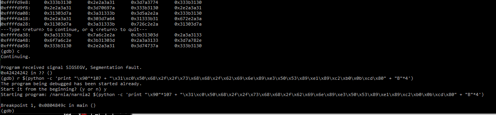
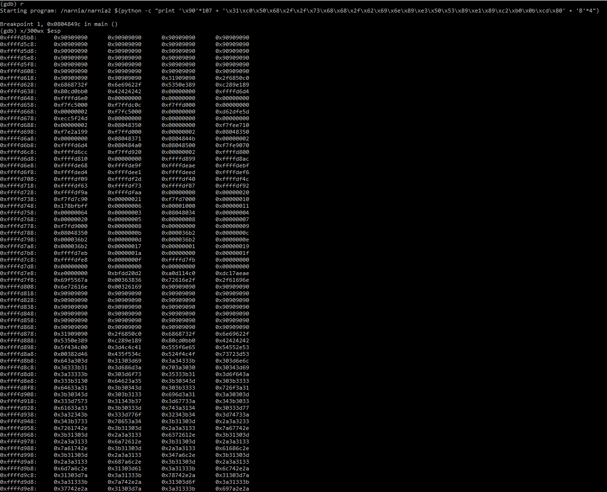
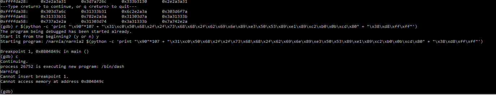
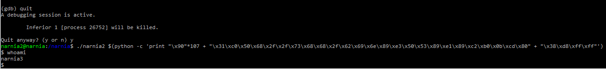

### [The learning phase]
Learning about Binary Exploitation. One of the best videos i've found on binary exploitation: https://www.youtube.com/watch?v=VroEiMOJPm8


### [Buffer Overflow Journey]

We can see from the source code below that 128 bytes of data was allowed for input of data into the buffer. Secondly, the strcpy has an argv as input. argv can be exploited by inserting a variable with an os command as a value.



A very basic understanding of how the binary executes we execute the command, which requires arguments, we then type in test. It echo's back test. We can do some basic memory analysis using ltrace. Let's go further.



A basic test to perform, sending a large number of bytes (our A's) until the program cannot handle the amount of input. Once the program reaches its maximum amount of memory the program will break and result in a segment fault. Which is a huge indicator of a vulnerable binary. The program breaks at 132 bytes of data.



Let's disassemble the binary and set a break point to right before the return. In our case 0x0804849c - leave. This will allow us to loop execution. Let's send 132 bytes + 4 bytes of returning data which will get assigned back to the stack. After that, press C to continue execution. You will see 0x42424242 which are the 4 returning B's. We determined that the 4 bytes are properly being assigned back to the stack.



After execution your 132 bytes (A's * 132 + B's * 4) you can then review review the top 300 bytes within your stack by typing x/300wx $esp.



From this point we can craft our payload via shellcode of 25bytes. Also, you've only used 25 bytes so far, you now need to pad an addition 107 bytes and then 4 returning bytes (EIP). To safely pad bytes you should include NOP Sleds, which are bytes of '\x90'. Let's see how our payload is crafted.

Payload
```
\x31\xc0\x50\x68\x2f\x2f\x73\x68\x68\x2f\x62\x69\x6e\x89\xe3\x50\x53\x89\xe1\x89\xc2\xb0\x0b\xcd\x80
```

Crafted payload
```
$(python -c 'print "\x90" + "\x31\xc0\x50\x68\x2f\x2f\x73\x68\x68\x2f\x62\x69\x6e\x89\xe3\x50\x53\x89\xe1\x89\xc2\xb0\x0b\xcd\x80" + "B"*4')
```

Execute your craft payload and you should see execution, you should also see a returning address of 0x42424242.



Let's now execute the command then check the top 300 bytes of the stack. You should see tons of NOP Sled bytes which are available bytes to execute your payload on. Find any row with NOP Sleds and check the associated offset. In my case it's 0xffffd838. 



When you need to write that out into your payload. You write it backwards. 0xffffd838 -> \x38\xd8\xff\xff. Replace your 4 bytes of B's with your new 4 bytes and let's see how this executes.



Once your execute the crafted payload successfully you should see an output such as /bin/dash. You can easily test the exploit by exiting gdb and running the binary with the payload.


