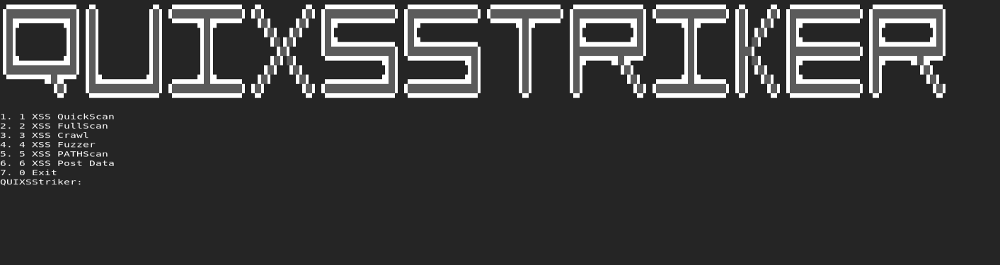

# QUIXSStriker


The following script will quickly use XSStriker. It's only a shortcut to the greatest XSS tool.

## Prerequisites

OS: Debian
Written in Ruby

##Installing gem
```
gem install bundler
```
If you already have bundler proceed with installing the lib.
```
bundle install
```

Crawl domains or Scan and Fuzz endpoints or url/path or even POST Data. seclogs.txt is also dumped to the same directory as the script. 
